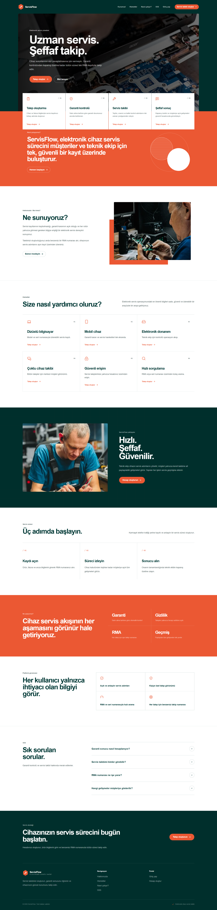
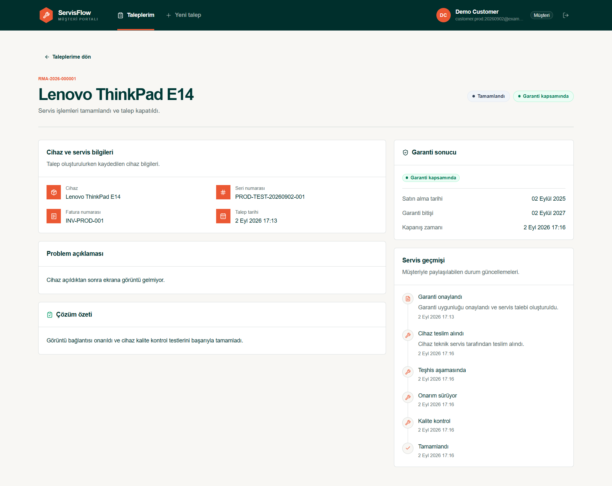
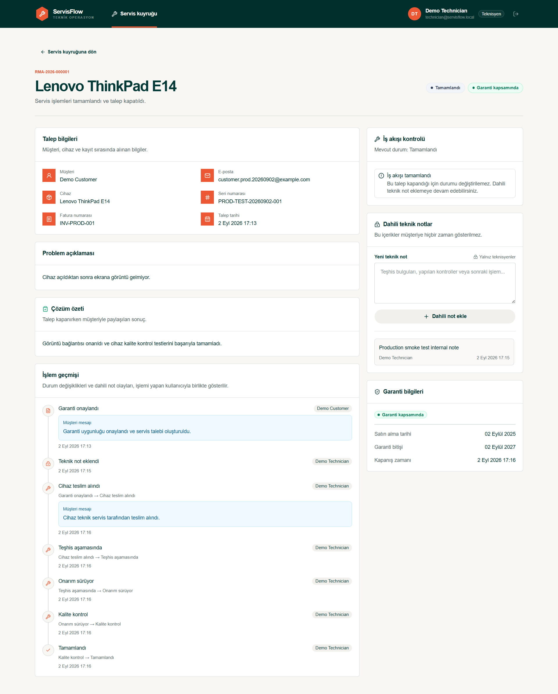
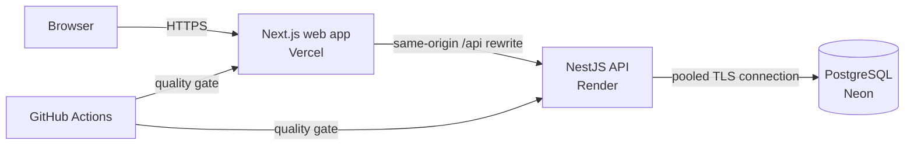
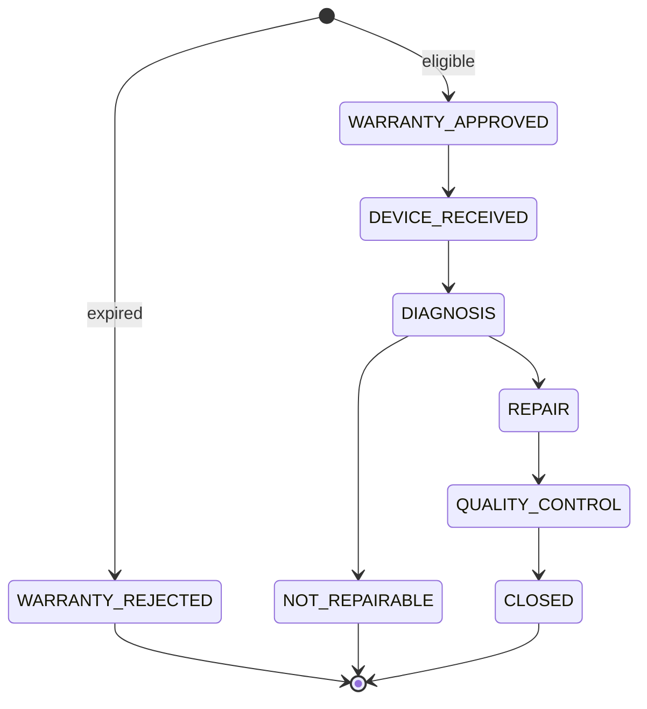

# ServisFlow

[](https://github.com/miracozmen23/servisflow/actions/workflows/ci.yml)


ServisFlow is a full-stack warranty and repair workflow application for electronic device service operations. Customers can create service requests, receive an automatically calculated warranty decision, and follow every customer-facing update through a clear timeline. Technicians work from a separate role-based workspace where they can search the queue, move requests through controlled repair stages, and keep internal notes that never appear in the customer view.

The interface is in Turkish. The codebase, API documentation, and project documentation use English.

[Live application](https://servisflow-web-silk.vercel.app/) · [Swagger API](https://servisflow-api.onrender.com/api/docs) · [API health](https://servisflow-api.onrender.com/api/health)

> The API runs on Render's free tier and may need a short cold start after a period of inactivity. The web application detects this state and retries while showing an availability notice.



## Product capabilities

- Customer registration, login, persistent server-side sessions, and logout.
- Separate customer and technician portals protected by role-based access control.
- Warranty evaluation from the purchase date using a 24-calendar-month rule.
- Concurrency-safe, annual RMA numbers in the `RMA-YYYY-000001` format.
- Paginated request lists with status filtering and RMA/serial-number search.
- A guarded repair workflow that rejects invalid or out-of-order status changes.
- Customer-facing status messages and a complete technician audit timeline.
- Internal technician notes excluded from every customer response projection.
- Required resolution summaries when a request is closed or marked not repairable.
- Responsive layouts for desktop, tablet, and mobile use.
- OpenAPI/Swagger documentation, health monitoring, automated tests, and containerized builds.

| Customer request detail | Technician workspace |
| --- | --- |
|  |  |

## System architecture

ServisFlow is an npm-workspaces monorepo containing two independently deployable applications. The backend is a modular NestJS application rather than a distributed microservice system; this keeps business transactions and authorization boundaries straightforward while the current product remains compact.



The browser calls `/api` on the same Vercel origin. Next.js rewrites those requests to the Render API, so the session cookie remains first-party and no public API URL is embedded in browser code. Render connects to Neon through the pooled runtime connection string; schema migrations use Neon's direct connection string outside the application runtime.

For local production-like execution, Docker Compose starts PostgreSQL, runs the migration image once, then starts the API and web containers only after their dependencies are ready.

## Technology stack

### Foundation and language

| Technology | Version | Responsibility and rationale |
| --- | ---: | --- |
| TypeScript | 5.x | Provides one strongly typed language across the browser, API, tests, configuration, and database access. Strict compiler options catch contract mistakes before runtime. |
| Node.js | 24 | Runs both applications and the repository tooling. The exact supported major range is declared in the root `package.json`. |
| npm workspaces | npm 11 | Manages `apps/web` and `apps/api` from one lockfile while preserving separate application packages and scripts. |

### Web application

| Technology | Version | Responsibility and rationale |
| --- | ---: | --- |
| Next.js App Router | 16.3.3 | Supplies route-based layouts, server-aware configuration, optimized production builds, and the same-origin API rewrite used in deployment. |
| React | 19.2.8 | Builds the interactive customer and technician portals from reusable components. |
| Tailwind CSS | 4 | Implements the responsive design system without scattering one-off inline styles throughout the application. |
| shadcn/ui + Radix UI | 4.19 / 1.6 | Provides accessible component primitives that remain fully owned and customizable inside the repository. |
| TanStack Query | 5.102 | Coordinates authenticated API reads, loading/error states, caching, and invalidation after mutations. |
| React Hook Form | 7.87 | Keeps form state and validation feedback efficient for registration, login, service-request, status, and note forms. |
| Zod | 4.5 | Defines client-side form schemas and produces predictable, user-facing validation errors. Backend validation remains authoritative. |
| Lucide React | 1.38 | Supplies consistent interface icons without image sprites or a heavy icon framework. |
| Sonner | 2.0 | Displays non-blocking success and failure notifications for user actions. |

### API and data layer

| Technology | Version | Responsibility and rationale |
| --- | ---: | --- |
| NestJS | 11.2 | Organizes controllers, services, guards, modules, validation, and dependency injection around explicit domain boundaries. |
| Express adapter | 11.2 | Serves the NestJS HTTP application and manages the secure session cookie. |
| Prisma ORM | 7.10 | Defines the relational schema, generates the typed client, and versions database changes through checked-in migrations. |
| Prisma PostgreSQL adapter + `pg` | 7.10 / 8.23 | Uses the standard PostgreSQL driver and connection pool beneath Prisma. |
| PostgreSQL | 17 | Stores users, hashed sessions, service requests, notes, audit events, migrations, and annual RMA sequences with transactional guarantees. |
| class-validator + class-transformer | 0.15 / 0.5 | Validate and normalize incoming DTOs before domain code receives them. Unknown properties are rejected globally. |
| bcryptjs | 3.0 | Hashes passwords with a cost factor of 12; plaintext passwords are never stored. |
| Helmet | 8.3 | Applies baseline HTTP security headers to API responses. |
| NestJS Throttler | 6.5 | Enforces a global request limit and a stricter limit on registration and login endpoints. |
| Swagger / OpenAPI | 11.4 | Generates an interactive API contract from the NestJS controllers and DTO metadata. |

### Testing, delivery, and hosting

| Technology | Responsibility and rationale |
| --- | --- |
| Jest + Supertest | Cover domain functions, guards, configuration, controllers, authentication, authorization, database behavior, concurrent RMA creation, and complete request workflows. |
| ESLint + Prettier | Keep TypeScript and UI code consistent and catch unsafe or accidental patterns during development and CI. |
| Docker + Docker Compose | Create reproducible API/web images and a local PostgreSQL environment with health-gated startup and one-shot migrations. |
| GitHub Actions | Runs migrations, type checking, linting, unit tests, end-to-end tests, and both production builds for every pull request and every push to `main`. |
| Vercel | Hosts the Next.js frontend and proxies same-origin `/api` traffic to the backend. |
| Render | Builds and runs the NestJS API from its multi-stage Dockerfile. |
| Neon | Hosts managed serverless PostgreSQL in the Frankfurt region, with separate pooled runtime and direct migration connections. |

## Domain rules

### Warranty policy

Warranty is evaluated on the API, never trusted from the browser:

1. The purchase date must be a valid calendar date and cannot be later than the current business date.
2. The business date is calculated in the `Europe/Istanbul` time zone.
3. The warranty expiration date is exactly 24 calendar months after the purchase date.
4. The expiration day is inclusive. A request made on that date is still approved.
5. An expired request is recorded as `WARRANTY_REJECTED` and closed immediately, preserving the decision in the audit history.

This is an application-level demonstration rule, not a statement of legal warranty policy for a specific company or jurisdiction.

### Repair workflow



Only technicians can change a status. The API validates the next allowed state, performs an optimistic concurrency check, writes the new state, and adds its audit event in a single database transaction. `NOT_REPAIRABLE` and `CLOSED` require a resolution summary; terminal states cannot be reopened.

### RMA numbering

Each accepted creation transaction atomically inserts or increments the `RmaSequence` row for the Istanbul business year. The returned sequence is formatted as `RMA-YYYY-NNNNNN`. PostgreSQL's `INSERT ... ON CONFLICT ... DO UPDATE ... RETURNING` operation prevents duplicate numbers under concurrent requests, and the unique database constraint remains a second line of defense.

### Role projections

| Capability | Customer | Technician |
| --- | :---: | :---: |
| Register and create a session | Yes | Seeded account |
| Create a service request | Yes | No |
| List and open requests | Own requests only | All requests |
| Filter/search the service queue | Own scope | Full queue |
| Change request status | No | Yes |
| Add/read internal notes | No | Yes |
| Read customer-facing history | Yes | Yes |
| Read full actor/audit history | No | Yes |

Customer authorization is enforced in database queries as well as route guards. A request owned by another customer is returned as not found, and internal note events are excluded before the customer response is built.

## Security design

- Passwords are hashed with bcrypt using cost factor 12 and the bcrypt 72-byte boundary is validated explicitly.
- Login performs a dummy hash comparison for unknown accounts to reduce user-enumeration timing differences.
- Sessions use 32 cryptographically random bytes. Only their SHA-256 hashes are stored in PostgreSQL.
- Session cookies expire after seven days and use `HttpOnly`, `SameSite=Lax`, `Path=/api`, and `Secure` in production.
- Logout revokes the current server-side session rather than only removing the browser cookie.
- Role guards and ownership-scoped queries enforce server-side authorization.
- A global validation pipe transforms valid DTOs, rejects unknown fields, and blocks malformed input.
- Helmet security headers, request throttling, normalized e-mail addresses, parameterized database access, and UUID validation reduce common attack surface.
- Secrets are provided only through environment variables. Production database credentials are not copied into Docker image layers or committed to Git.

ServisFlow is a portfolio/demo deployment rather than an audited production service. Do not enter real customer, device, invoice, or other personally identifiable information into the public demo.

## API overview

All application routes use the `/api` prefix. Successful resource responses use a `data` envelope, paginated lists include `meta`, and errors have stable `statusCode`, `code`, and `message` fields.

| Method | Route | Access | Purpose |
| --- | --- | --- | --- |
| `POST` | `/api/auth/register` | Public | Create a customer and start a session. |
| `POST` | `/api/auth/login` | Public | Authenticate and start a session. |
| `POST` | `/api/auth/logout` | Authenticated | Revoke the current session. |
| `GET` | `/api/auth/me` | Authenticated | Return the current user. |
| `GET` | `/api/health` | Public | Report API and database availability. |
| `POST` | `/api/service-requests` | Customer | Create a warranty-aware request and RMA. |
| `GET` | `/api/service-requests` | Customer/Technician | Return a paginated, role-scoped list. |
| `GET` | `/api/service-requests/:id` | Customer/Technician | Return the role-projected request detail. |
| `PATCH` | `/api/service-requests/:id/status` | Technician | Apply one allowed workflow transition. |
| `POST` | `/api/service-requests/:id/notes` | Technician | Add an internal technician note. |

The interactive [Swagger documentation](https://servisflow-api.onrender.com/api/docs) contains the DTO fields, enum values, query parameters, and response descriptions.

## Repository structure

```text
servisflow/
├── apps/
│   ├── api/                    # NestJS API, Prisma schema, migrations and tests
│   │   ├── prisma/
│   │   ├── src/
│   │   ├── test/
│   │   └── Dockerfile
│   └── web/                    # Next.js customer/technician interface
│       ├── public/
│       ├── src/app/
│       ├── src/components/
│       └── Dockerfile
├── docs/                       # Screenshots and visual-asset credits
├── .github/workflows/ci.yml    # Pull-request and main-branch quality gate
├── compose.yaml                # Production-like local stack
├── package.json                # Workspace scripts and runtime constraints
└── package-lock.json           # Reproducible dependency graph
```

## Local development

### Prerequisites

- Node.js 24.x
- npm 11.x
- Docker Desktop with the WSL 2 backend on Windows, or a compatible Docker Engine
- Git

### 1. Clone and install

```powershell
git clone https://github.com/miracozmen23/servisflow.git
Set-Location servisflow
npm.cmd install
```

On macOS or Linux, use `npm` in place of `npm.cmd`.

### 2. Configure the environment

```powershell
Copy-Item .env.example .env
```

Replace both password placeholders in `.env` with strong local-only values. The password embedded in `DATABASE_URL` must match `POSTGRES_PASSWORD`; URL-encode it if it contains reserved URL characters. Never commit `.env`.

| Variable | Purpose |
| --- | --- |
| `NODE_ENV` | Selects development, test, or production behavior. |
| `PORT` | API listening port; local default is `3001`. |
| `POSTGRES_DB`, `POSTGRES_USER`, `POSTGRES_PASSWORD`, `POSTGRES_PORT` | Configure the local Compose database. |
| `DATABASE_URL` | PostgreSQL URL consumed by Prisma and the API. |
| `SEED_TECHNICIAN_EMAIL` | E-mail for the idempotent technician seed. |
| `SEED_TECHNICIAN_PASSWORD` | Local technician password; keep it private. |
| `SEED_TECHNICIAN_FIRST_NAME`, `SEED_TECHNICIAN_LAST_NAME` | Display name for the seeded technician. |
| `API_PROXY_TARGET` | Backend origin used by the Next.js `/api` rewrite; defaults to local port `3001`. |

### 3. Start PostgreSQL and prepare the database

```powershell
docker compose up -d postgres
npm.cmd run prisma:migrate:deploy --workspace=@servisflow/api
npm.cmd run prisma:seed --workspace=@servisflow/api
```

The seed is idempotent: rerunning it updates the configured technician instead of creating duplicate accounts.

### 4. Run both applications

Open two terminals from the repository root:

```powershell
# Terminal 1
npm.cmd run dev:api

# Terminal 2
npm.cmd run dev:web
```

Local endpoints:

- Web application: <http://localhost:3000>
- API: <http://localhost:3001/api>
- Swagger: <http://localhost:3001/api/docs>
- Health: <http://localhost:3001/api/health>

### Full Docker stack

To build and run the database, migration job, API, and web application together:

```powershell
docker compose up --build
```

Stop the stack without deleting its PostgreSQL volume:

```powershell
docker compose down
```

## Demo access

Customers can create their own account from the public registration page. A technician account is seeded as `technician@servisflow.local`; its password is intentionally not published and is available from the project owner on request.

## Quality assurance

Run the complete local quality gate from the repository root:

```powershell
npm.cmd run typecheck
npm.cmd run lint
npm.cmd run test
npm.cmd run test:e2e
npm.cmd run build
```

The end-to-end suite requires an available PostgreSQL database configured by `DATABASE_URL`. The current automated suite contains 30 unit tests and 31 API end-to-end tests. It exercises, among other cases:

- warranty boundary dates, leap/calendar behavior, and future-date rejection;
- registration, login, logout, expired/revoked sessions, and cookie behavior;
- customer ownership boundaries and technician-only operations;
- concurrent RMA creation and annual sequence formatting;
- valid, invalid, concurrent, and terminal status transitions;
- required resolution summaries and isolation of internal technician notes;
- pagination, filtering, search, error contracts, and database-aware health checks.

GitHub Actions repeats the migration, type check, lint, tests, and production builds in a PostgreSQL 17 environment before changes are merged.

## Deployment notes

The current hosted topology is:

- **Web:** Vercel, built from `apps/web` with `API_PROXY_TARGET` pointing to Render.
- **API:** Render, built from `apps/api/Dockerfile`, with `/api/health` as the health check.
- **Database:** Neon PostgreSQL in Frankfurt. The pooled URL is used at runtime and the direct URL is used for migrations.
- **Delivery:** both services deploy from `main` after the GitHub Actions quality gate succeeds.

Production secrets belong in each provider's encrypted environment settings. Do not copy `.env`, a Neon connection string, or a technician password into source code, Docker build arguments, screenshots, issues, or pull requests.

Free hosting is suitable for demonstration but includes cold starts, resource limits, and no availability guarantee. A production rollout should add managed secret rotation, backups and restore testing, observability/alerting, data-retention policy, custom domains, and an operational incident process.

## Visual assets

The interface uses locally stored, royalty-free Pexels photography so runtime rendering does not depend on third-party image hosts. Photographer attribution and source links are recorded in [`docs/visual-assets.md`](docs/visual-assets.md).

