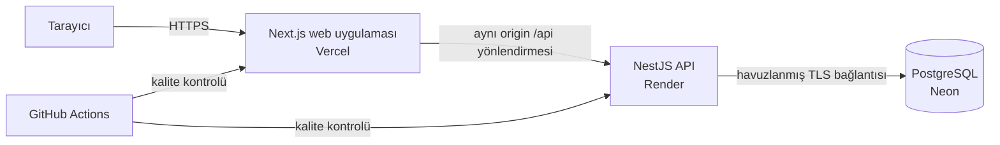

# ServisFlow

[](https://github.com/miracozmen23/servisflow/actions/workflows/ci.yml)


ServisFlow, elektronik cihaz servis operasyonları için geliştirilmiş tam kapsamlı bir garanti ve onarım iş akışı uygulamasıdır. Müşteriler servis talebi oluşturabilir, otomatik hesaplanan garanti sonucunu görebilir ve kendileriyle paylaşılan tüm gelişmeleri anlaşılır bir zaman çizelgesi üzerinden takip edebilir. Teknisyenler ise ayrı ve rol korumalı bir çalışma alanından servis kuyruğunu arayabilir, talepleri kontrollü onarım aşamalarından geçirebilir ve müşteriye hiçbir zaman gösterilmeyen dahili notlar tutabilir.

Uygulama arayüzü ve proje dokümantasyonu Türkçedir. Kod tabanı ile API sözleşmesinde uluslararası geliştirme standartlarına uygun İngilizce adlandırmalar kullanılır.

[Canlı uygulama](https://servisflow-web-silk.vercel.app/) · [Swagger API](https://servisflow-api.onrender.com/api/docs) · [API sağlık durumu](https://servisflow-api.onrender.com/api/health)

> API, Render'ın ücretsiz planında çalıştığı için bir süre kullanılmadığında kısa bir soğuk başlatma süresine ihtiyaç duyabilir. Web uygulaması bu durumu algılar, kullanıcıya uygun bir bilgilendirme gösterir ve bağlantıyı otomatik olarak yeniden dener.


## Ürün özellikleri

- Müşteri kaydı, giriş, sunucu tarafında kalıcı oturum ve güvenli çıkış işlemleri.
- Rol tabanlı erişim kontrolüyle korunan ayrı müşteri ve teknisyen portalları.
- Satın alma tarihine göre 24 takvim aylık kuralla otomatik garanti değerlendirmesi.
- `RMA-YYYY-000001` biçiminde, yıllık ve eşzamanlı isteklere dayanıklı RMA numaraları.
- Durum filtresi ile RMA/seri numarası araması sunan sayfalanmış talep listeleri.
- Geçersiz veya sırası bozulmuş durum değişikliklerini reddeden kontrollü servis iş akışı.
- Müşteriye gösterilebilen durum mesajları ve teknisyen için eksiksiz işlem geçmişi.
- Müşteriye dönen tüm veri görünümlerinden ayrıştırılmış dahili teknisyen notları.
- Talep kapatılırken veya cihaz onarılamaz olarak işaretlenirken zorunlu çözüm özeti.
- Masaüstü, tablet ve mobil kullanıma uyumlu duyarlı arayüz.
- OpenAPI/Swagger dokümantasyonu, sağlık kontrolü, otomatik testler ve konteyner tabanlı derlemeler.

| Müşteri talep detayı | Teknisyen çalışma alanı |
| --- | --- |
|  |  |

## Sistem mimarisi

ServisFlow, birbirinden bağımsız dağıtılabilen iki uygulamayı barındıran bir npm workspaces monoreposudur. Backend, dağıtık bir mikroservis sistemi yerine modüler bir NestJS uygulaması olarak tasarlanmıştır. Bu yaklaşım, ürünün mevcut kapsamı kompakt kalırken iş kurallarını, veritabanı işlemlerini ve yetkilendirme sınırlarını anlaşılır tutar.



Tarayıcı, Vercel alan adındaki `/api` yoluna istek gönderir. Next.js bu istekleri Render üzerindeki API'ye yönlendirir. Böylece oturum çerezi birinci taraf olarak kalır ve herkese açık API adresinin tarayıcı koduna gömülmesi gerekmez. Render, çalışma zamanında havuzlanmış bağlantı adresiyle Neon'a bağlanır; şema migration işlemleri ise uygulama çalışma zamanının dışında Neon'un doğrudan bağlantı adresiyle yürütülür.

Yerel ortamda üretime benzer çalışma için Docker Compose önce PostgreSQL'i başlatır, migration imajını bir kez çalıştırır ve yalnızca bağımlılıkları hazır olduktan sonra API ile web konteynerlerini ayağa kaldırır.

## Teknoloji yığını

### Temel yapı ve programlama dili

| Teknoloji | Sürüm | Görevi ve tercih edilme nedeni |
| --- | ---: | --- |
| TypeScript | 5.x | Tarayıcı, API, testler, yapılandırma ve veritabanı erişiminde tek ve güçlü tip denetimli bir dil sağlar. Katı derleyici seçenekleri, sözleşme hatalarını çalışma zamanına ulaşmadan yakalar. |
| Node.js | 24 | Her iki uygulamayı ve depo araçlarını çalıştırır. Desteklenen ana sürüm aralığı kök `package.json` dosyasında açıkça tanımlanmıştır. |
| npm workspaces | npm 11 | `apps/web` ve `apps/api` paketlerini tek kilit dosyasından yönetirken uygulamaların kendi paketlerini ve komutlarını ayrı tutar. |

### Web uygulaması

| Teknoloji | Sürüm | Görevi ve tercih edilme nedeni |
| --- | ---: | --- |
| Next.js App Router | 16.3.3 | Rota tabanlı yerleşimleri, sunucu tarafını dikkate alan yapılandırmayı, optimize üretim derlemelerini ve dağıtımda kullanılan aynı origin API yönlendirmesini sağlar. |
| React | 19.2.8 | Müşteri ve teknisyen portallarındaki etkileşimli ekranları yeniden kullanılabilir bileşenlerle oluşturur. |
| Tailwind CSS | 4 | Tek seferlik satır içi stilleri uygulamanın farklı yerlerine dağıtmadan duyarlı tasarım sistemini uygular. |
| shadcn/ui + Radix UI | 4.19 / 1.6 | Erişilebilir arayüz temelleri sağlar; bileşenlerin kodu deponun içinde kaldığı için tasarım üzerinde tam özelleştirme imkânı sunar. |
| TanStack Query | 5.102 | Kimlik doğrulamalı API okumalarını, yüklenme/hata durumlarını, önbelleği ve değişikliklerden sonraki veri yenilemeyi yönetir. |
| React Hook Form | 7.87 | Kayıt, giriş, servis talebi, durum değişikliği ve not formlarında form durumunu ve doğrulama geri bildirimini verimli biçimde yönetir. |
| Zod | 4.5 | İstemci tarafındaki form şemalarını tanımlar ve tutarlı, kullanıcı dostu doğrulama hataları üretir. Nihai doğrulama yetkisi yine backend'dedir. |
| Lucide React | 1.38 | Görsel dosya paketlerine veya ağır bir ikon çatısına ihtiyaç duymadan tutarlı arayüz ikonları sağlar. |
| Sonner | 2.0 | Kullanıcı işlemlerinin başarı ve hata sonuçlarını akışı engellemeyen bildirimlerle gösterir. |

### API ve veri katmanı

| Teknoloji | Sürüm | Görevi ve tercih edilme nedeni |
| --- | ---: | --- |
| NestJS | 11.2 | Controller, service, guard, module, doğrulama ve bağımlılık enjeksiyonu yapılarını belirgin iş alanı sınırları etrafında düzenler. |
| Express adaptörü | 11.2 | NestJS HTTP uygulamasını sunar ve güvenli oturum çerezini yönetir. |
| Prisma ORM | 7.10 | İlişkisel şemayı tanımlar, tip güvenli istemciyi üretir ve veritabanı değişikliklerini depoda tutulan migration dosyalarıyla sürümlendirir. |
| Prisma PostgreSQL adaptörü + `pg` | 7.10 / 8.23 | Prisma'nın altında standart PostgreSQL sürücüsünü ve bağlantı havuzunu kullanır. |
| PostgreSQL | 17 | Kullanıcıları, hash'lenmiş oturumları, servis taleplerini, notları, işlem olaylarını, migration kayıtlarını ve yıllık RMA sayaçlarını işlemsel garantilerle saklar. |
| class-validator + class-transformer | 0.15 / 0.5 | Gelen DTO verilerini iş alanı koduna ulaşmadan önce doğrular ve dönüştürür. Tanımlanmamış alanlar genel seviyede reddedilir. |
| bcryptjs | 3.0 | Parolaları 12 maliyet faktörüyle hash'ler; düz metin parola hiçbir zaman saklanmaz. |
| Helmet | 8.3 | API yanıtlarına temel HTTP güvenlik başlıklarını uygular. |
| NestJS Throttler | 6.5 | Genel istek sınırı ile kayıt ve giriş uçlarındaki daha sıkı hız sınırlarını uygular. |
| Swagger / OpenAPI | 11.4 | NestJS controller ve DTO bilgilerinden etkileşimli API sözleşmesi üretir. |

### Test, teslimat ve barındırma

| Teknoloji | Görevi ve tercih edilme nedeni |
| --- | --- |
| Jest + Supertest | İş alanı fonksiyonlarını, guard yapılarını, yapılandırmayı, controller'ları, kimlik doğrulamayı, yetkilendirmeyi, veritabanı davranışını, eşzamanlı RMA üretimini ve uçtan uca servis akışlarını sınar. |
| ESLint + Prettier | TypeScript ve arayüz kodunda tutarlılık sağlar; güvensiz veya istemeden oluşmuş kalıpları geliştirme sırasında ve CI içinde yakalar. |
| Docker + Docker Compose | Tekrarlanabilir API/web imajları ile sağlık kontrolüne bağlı başlatma ve tek seferlik migration içeren yerel PostgreSQL ortamını oluşturur. |
| GitHub Actions | Her pull request'te ve `main` dalına yapılan her push'ta migration, tip kontrolü, lint, birim testleri, uçtan uca testler ve iki üretim derlemesini çalıştırır. |
| Vercel | Next.js frontend uygulamasını barındırır ve aynı origin üzerindeki `/api` trafiğini backend'e yönlendirir. |
| Render | NestJS API'yi çok aşamalı Dockerfile üzerinden derler ve çalıştırır. |
| Neon | Yönetilen serverless PostgreSQL'i Frankfurt bölgesinde barındırır; çalışma zamanı için havuzlanmış, migration için doğrudan bağlantı sunar. |

## İş kuralları

### Garanti politikası

Garanti kararı API üzerinde hesaplanır; tarayıcıdan gelen bir sonuca güvenilmez:

1. Satın alma tarihi geçerli bir takvim tarihi olmalı ve mevcut iş tarihinden ileride olmamalıdır.
2. İş tarihi `Europe/Istanbul` saat diliminde hesaplanır.
3. Garanti bitiş tarihi, satın alma tarihinden tam 24 takvim ayı sonrasıdır.
4. Garanti bitiş günü kapsama dahildir. O gün oluşturulan talep hâlâ onaylanır.
5. Süresi geçmiş talep `WARRANTY_REJECTED` olarak kaydedilir ve karar işlem geçmişinde korunarak hemen kapatılır.

Bu, uygulama seviyesinde tanımlanmış bir demo kuralıdır; belirli bir şirket veya ülke için hukuki garanti politikası beyanı değildir.

### Servis iş akışı


Yalnızca teknisyenler talep durumunu değiştirebilir. API; izin verilen bir sonraki durumu doğrular, iyimser eşzamanlılık kontrolünü uygular, yeni durumu yazar ve işlem olayını aynı veritabanı transaction'ı içinde kaydeder. `NOT_REPAIRABLE` ve `CLOSED` durumları için çözüm özeti zorunludur; terminal durumlar yeniden açılamaz.

### RMA numaralandırması

Başarıyla kabul edilen her talep oluşturma transaction'ı, İstanbul iş yılına ait `RmaSequence` satırını atomik olarak ekler veya artırır. Dönen sıra numarası `RMA-YYYY-NNNNNN` biçimine dönüştürülür. PostgreSQL'in `INSERT ... ON CONFLICT ... DO UPDATE ... RETURNING` işlemi eşzamanlı taleplerde yinelenen numara oluşmasını engeller; veritabanındaki benzersizlik kısıtı da ikinci bir koruma katmanı sağlar.

### Role göre veri görünümü

| Yetki | Müşteri | Teknisyen |
| --- | :---: | :---: |
| Kayıt olma ve oturum başlatma | Evet | Seed ile oluşturulan hesap |
| Servis talebi oluşturma | Evet | Hayır |
| Talepleri listeleme ve açma | Yalnızca kendi talepleri | Tüm talepler |
| Servis kuyruğunda filtreleme/arama | Kendi kapsamı | Tüm kuyruk |
| Talep durumunu değiştirme | Hayır | Evet |
| Dahili not ekleme/okuma | Hayır | Evet |
| Müşteriye açık geçmişi okuma | Evet | Evet |
| Tüm kullanıcı ve işlem geçmişini okuma | Hayır | Evet |

Müşteri yetkilendirmesi yalnızca rota guard'larında değil, veritabanı sorgularında da uygulanır. Başka bir müşteriye ait talep `not found` olarak döndürülür ve dahili not olayları müşteri yanıtı oluşturulmadan önce veri görünümünden çıkarılır.

## Güvenlik tasarımı

- Parolalar 12 maliyet faktörüyle bcrypt kullanılarak hash'lenir ve bcrypt'in 72 baytlık sınırı açıkça doğrulanır.
- Bilinmeyen hesaplarda giriş süresi üzerinden kullanıcı tespitini zorlaştırmak için sahte bir hash karşılaştırması yapılır.
- Oturumlar kriptografik olarak rastgele 32 bayt kullanır. PostgreSQL'de yalnızca bu değerlerin SHA-256 hash'leri saklanır.
- Oturum çerezleri yedi gün sonra sona erer; `HttpOnly`, `SameSite=Lax` ve `Path=/api` özelliklerini, üretimde ayrıca `Secure` özelliğini kullanır.
- Çıkış işlemi yalnızca tarayıcı çerezini silmek yerine mevcut sunucu oturumunu iptal eder.
- Rol guard'ları ve sahiplik kapsamlı sorgular sunucu tarafı yetkilendirmesini uygular.
- Genel doğrulama pipe'ı geçerli DTO'ları dönüştürür, bilinmeyen alanları ve hatalı girdileri reddeder.
- Helmet güvenlik başlıkları, istek hız sınırı, normalize edilmiş e-posta adresleri, parametreli veritabanı erişimi ve UUID doğrulaması yaygın saldırı yüzeyini azaltır.
- Gizli bilgiler yalnızca ortam değişkenleriyle sağlanır. Üretim veritabanı kimlik bilgileri Docker imaj katmanlarına kopyalanmaz ve Git'e kaydedilmez.

ServisFlow, güvenlik denetiminden geçirilmiş kurumsal bir servis değil, portföy/demo amaçlı bir dağıtımdır. Herkese açık demoya gerçek müşteri, cihaz, fatura veya başka bir kişisel bilgi girmeyin.

## API özeti

Tüm uygulama rotaları `/api` ön ekini kullanır. Başarılı kaynak yanıtları `data` zarfıyla döner, sayfalanmış listeler `meta` bilgisi içerir ve hatalar sabit `statusCode`, `code` ve `message` alanlarına sahiptir.

| Metot | Rota | Erişim | Amaç |
| --- | --- | --- | --- |
| `POST` | `/api/auth/register` | Herkese açık | Müşteri oluşturur ve oturum başlatır. |
| `POST` | `/api/auth/login` | Herkese açık | Kimlik doğrular ve oturum başlatır. |
| `POST` | `/api/auth/logout` | Oturum gerekli | Mevcut oturumu iptal eder. |
| `GET` | `/api/auth/me` | Oturum gerekli | Mevcut kullanıcıyı döndürür. |
| `GET` | `/api/health` | Herkese açık | API ve veritabanı erişilebilirliğini bildirir. |
| `POST` | `/api/service-requests` | Müşteri | Garanti değerlendirmeli talep ve RMA oluşturur. |
| `GET` | `/api/service-requests` | Müşteri/Teknisyen | Sayfalanmış ve role göre kapsamlanmış listeyi döndürür. |
| `GET` | `/api/service-requests/:id` | Müşteri/Teknisyen | Role göre ayrıştırılmış talep detayını döndürür. |
| `PATCH` | `/api/service-requests/:id/status` | Teknisyen | İzin verilen bir iş akışı geçişini uygular. |
| `POST` | `/api/service-requests/:id/notes` | Teknisyen | Dahili teknisyen notu ekler. |

Etkileşimli [Swagger dokümantasyonu](https://servisflow-api.onrender.com/api/docs), DTO alanlarını, enum değerlerini, sorgu parametrelerini ve yanıt açıklamalarını içerir.

## Depo yapısı

```text
servisflow/
├── apps/
│   ├── api/                    # NestJS API, Prisma şeması, migration dosyaları ve testler
│   │   ├── prisma/
│   │   ├── src/
│   │   ├── test/
│   │   └── Dockerfile
│   └── web/                    # Next.js müşteri ve teknisyen arayüzü
│       ├── public/
│       ├── src/app/
│       ├── src/components/
│       └── Dockerfile
├── docs/                       # Ekran görüntüleri ve görsel kaynak bilgileri
├── .github/workflows/ci.yml    # Pull request ve main dalı kalite kontrolü
├── compose.yaml                # Üretime benzer yerel çalışma ortamı
├── package.json                # Workspace komutları ve çalışma zamanı sınırları
└── package-lock.json           # Tekrarlanabilir bağımlılık ağacı
```

## Yerel geliştirme

### Gereksinimler

- Node.js 24.x
- npm 11.x
- Windows için WSL 2 backend kullanan Docker Desktop veya uyumlu bir Docker Engine
- Git

### 1. Depoyu klonlayın ve bağımlılıkları yükleyin

```powershell
git clone https://github.com/miracozmen23/servisflow.git
Set-Location servisflow
npm.cmd install
```

macOS veya Linux kullanıyorsanız `npm.cmd` yerine `npm` komutunu kullanın.

### 2. Ortam değişkenlerini yapılandırın

```powershell
Copy-Item .env.example .env
```

`.env` içindeki iki parola yer tutucusunu güçlü ve yalnızca yerel ortamda kullanılacak değerlerle değiştirin. `DATABASE_URL` içine yazılan parola `POSTGRES_PASSWORD` ile aynı olmalıdır; URL için ayrılmış karakterler içeriyorsa URL kodlaması uygulayın. `.env` dosyasını hiçbir zaman Git'e eklemeyin.

| Değişken | Amaç |
| --- | --- |
| `NODE_ENV` | Development, test veya production davranışını seçer. |
| `PORT` | API'nin dinlediği porttur; yerel varsayılan değer `3001`'dir. |
| `POSTGRES_DB`, `POSTGRES_USER`, `POSTGRES_PASSWORD`, `POSTGRES_PORT` | Yerel Compose veritabanını yapılandırır. |
| `DATABASE_URL` | Prisma ve API tarafından kullanılan PostgreSQL bağlantı adresidir. |
| `SEED_TECHNICIAN_EMAIL` | Tekrarlanabilir teknisyen seed işleminin e-posta adresidir. |
| `SEED_TECHNICIAN_PASSWORD` | Yerel teknisyen parolasıdır; gizli tutulmalıdır. |
| `SEED_TECHNICIAN_FIRST_NAME`, `SEED_TECHNICIAN_LAST_NAME` | Seed ile oluşturulan teknisyenin görünen adıdır. |
| `API_PROXY_TARGET` | Next.js `/api` yönlendirmesinin backend adresidir; varsayılan olarak yerel `3001` portunu kullanır. |

### 3. PostgreSQL'i başlatın ve veritabanını hazırlayın

```powershell
docker compose up -d postgres
npm.cmd run prisma:migrate:deploy --workspace=@servisflow/api
npm.cmd run prisma:seed --workspace=@servisflow/api
```

Seed işlemi idempotent'tir: yeniden çalıştırıldığında ikinci bir hesap oluşturmak yerine yapılandırılmış teknisyeni günceller.

### 4. İki uygulamayı çalıştırın

Depo kök dizininde iki terminal açın:

```powershell
# Terminal 1
npm.cmd run dev:api

# Terminal 2
npm.cmd run dev:web
```

Yerel adresler:

- Web uygulaması: <http://localhost:3000>
- API: <http://localhost:3001/api>
- Swagger: <http://localhost:3001/api/docs>
- Sağlık kontrolü: <http://localhost:3001/api/health>

### Docker ile tüm servisleri çalıştırma

Veritabanını, migration görevini, API'yi ve web uygulamasını birlikte derleyip çalıştırmak için:

```powershell
docker compose up --build
```

PostgreSQL volume'unu silmeden tüm servisleri durdurmak için:

```powershell
docker compose down
```

## Demo erişimi

Müşteriler herkese açık kayıt sayfasından kendi hesaplarını oluşturabilir. `technician@servisflow.local` adresli teknisyen hesabı seed işlemiyle hazırlanır; parolası bilinçli olarak yayımlanmamıştır ve gerektiğinde proje sahibinden istenebilir.

## Kalite güvencesi

Yerel kalite kontrollerinin tamamını depo kök dizininden çalıştırın:

```powershell
npm.cmd run typecheck
npm.cmd run lint
npm.cmd run test
npm.cmd run test:e2e
npm.cmd run build
```

Uçtan uca test paketi, `DATABASE_URL` ile yapılandırılmış erişilebilir bir PostgreSQL veritabanı gerektirir. Mevcut otomatik test paketi 30 birim testi ve 31 API uçtan uca testi içerir. Test edilen başlıca durumlar şunlardır:

- garanti sınır tarihleri, artık yıl/takvim davranışı ve gelecek tarih reddi;
- kayıt, giriş, çıkış, süresi dolmuş/iptal edilmiş oturumlar ve çerez davranışı;
- müşteri sahiplik sınırları ve yalnızca teknisyene açık işlemler;
- eşzamanlı RMA oluşturma ve yıllık sıra biçimi;
- geçerli, geçersiz, eşzamanlı ve terminal durum geçişleri;
- zorunlu çözüm özetleri ve dahili teknisyen notlarının müşteriden ayrıştırılması;
- sayfalama, filtreleme, arama, hata sözleşmeleri ve veritabanını da doğrulayan sağlık kontrolü.

GitHub Actions; değişiklikler birleştirilmeden önce migration işlemini, tip kontrolünü, lint'i, testleri ve üretim derlemelerini PostgreSQL 17 ortamında tekrarlar.

## Dağıtım notları

Mevcut canlı sistem aşağıdaki bileşenlerden oluşur:

- **Web:** Vercel üzerinde `apps/web` dizininden derlenir; `API_PROXY_TARGET` Render adresini gösterir.
- **API:** Render üzerinde `apps/api/Dockerfile` dosyasından derlenir; sağlık kontrolü için `/api/health` kullanılır.
- **Veritabanı:** Frankfurt bölgesindeki Neon PostgreSQL'dir. Çalışma zamanında havuzlanmış adres, migration işlemlerinde doğrudan adres kullanılır.
- **Teslimat:** GitHub Actions kalite kontrolü başarılı olduktan sonra iki servis de `main` dalından dağıtılır.

Üretim sırları, ilgili sağlayıcıların şifreli ortam değişkenlerinde tutulmalıdır. `.env` dosyasını, Neon bağlantı adresini veya teknisyen parolasını kaynak koda, Docker derleme argümanlarına, ekran görüntülerine, issue'lara ya da pull request'lere kopyalamayın.

Ücretsiz barındırma demo için uygundur; ancak soğuk başlatma, kaynak sınırları ve kesintisiz erişim garantisinin olmaması gibi kısıtlar taşır. Gerçek bir üretim ortamında yönetilen sır rotasyonu, yedekleme ve geri yükleme testleri, gözlemlenebilirlik/uyarı sistemi, veri saklama politikası, özel alan adları ve operasyonel olay yönetimi eklenmelidir.

## Görsel kaynaklar

Arayüz, çalışma zamanında üçüncü taraf görsel sunucularına bağımlı kalmamak için yerel olarak saklanan ve telifsiz kullanılabilen Pexels fotoğraflarından yararlanır. Fotoğrafçı bilgileri ile kaynak bağlantıları [`docs/visual-assets.md`](docs/visual-assets.md) dosyasında kayıtlıdır.

